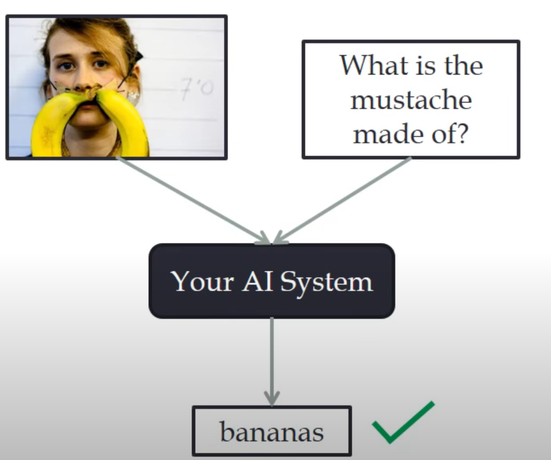
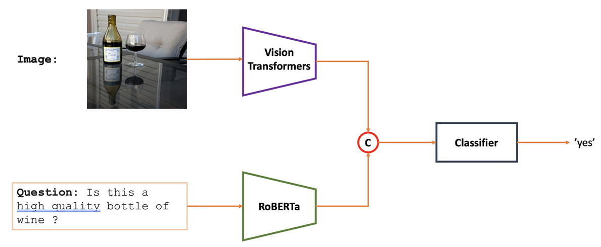

## ABOUT VISUAL QA
Visual Question Answering (VQA) is an interdisciplinary research area that lies at the intersection of computer vision (CV) and natural language processing (NLP). It aims to develop AI systems capable of understanding and answering questions about images. For better understanding, you can look over this [page](https://visualqa.org/) where our projects focus on [binaryQA](https://arxiv.org/pdf/1511.05099.pdf)
<p> align="center">
 
</p>

## Additional
### Challenges:
- Understanding Images: Extracting meaningful information from images is challenging due to variations in lighting, viewpoint, occlusions, etc.
- Understanding Questions: Interpreting natural language questions accurately and comprehensively is complex, especially considering the diverse ways humans can express the same concept.
- Fusion of Vision and Language: Integrating information from both visual and textual modalities effectively is crucial for accurate answers.
### Approaches:
- Feature Extraction: Extracting features from images using pre-trained convolutional neural networks (CNNs) like ResNet, VGG, or transformers like Vision Transformers (ViTs).
- Language Understanding: Utilizing pre-trained language models (LMs) like BERT, GPT, or specific models for question understanding.
- Fusion Techniques: Combining visual and textual features through methods like concatenation, attention mechanisms, or multi-modal embeddings.
- Answer Prediction: Predicting answers using classification techniques, generating answers with sequence models, or using attention mechanisms.

## Getting Start
- Install needed packages through 
``` python
requirements.txt 
```
- Preprocess the original dataset via 
``` 
dataset/preprocess.py 
```
- Our approach using Transformers-based text model and visual Pretrained model. They are in `model.py` and training process in `train.py`. We also test on several methods to explore the performance of different architecture on this task.
| Approach       | Accuracy   |
|--------------|------------|
| CNN x LSTM     | 69.57 %        |
| ViT x Roberta      | 66.7%        |
| Pretrained CLIPs      | 75.57%        |

Below is a brief overview of our approach.
<p align="center">
 
</p>

